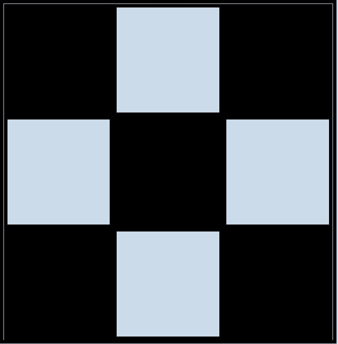

дз:
==
 створити ось таку маленьку шахову дошку. Для цього треба використовувати вивчений матеріал по темі flexbox та по темі псевдокласів.

 https://stackoverflow.com/questions/29421679/style-every-4th-alternative-odd-even-nth-child2n-without-jquery

 https://techosmo.com/hacker-noon/css-flexbox-cheat-sheets-for-web-developers-in-2021/elopers

